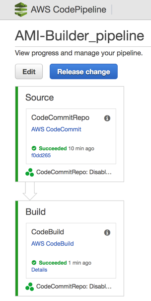

## Purpose

This Packer AMI Builder creates a new AMI out of the latest Amazon Linux AMI, and installs OpenVPN. The code also includes terraform to orchestrate all the components. AWS CodePipeline is leveraged to orchestrate the entire process.


## Source code structure

```bash
├── ansible
│   ├── playbook.yaml                       <-- Ansible playbook file
│   ├── requirements.yaml                   <-- Ansible Galaxy requirements containing Roles CIS, OpenVPN, Cloudwatch
│   └── roles
│       ├── common                          <-- Upgrades all packages through ``yum``
├── buildspec.yml                           <-- CodeBuild spec
├── terraform                               <-- Terraform to create entire pipeline
│   └── pipeline.tf
├── packer_cis.json                         <-- Packer template for Pipeline
```


## Cloudformation template

Terraform will create the following resources as part of the AMI Builder for Packer:

    * ``terraform/pipeline.tf``
    + Github - Git repository
    + AWS CodeBuild - Downloads Packer and run Packer to build AMI
    + AWS CodePipeline - Orchestrates pipeline and listen for new commits in CodeCommit
    + Amazon SNS Topic - AMI Builds Notification via subscribed SNS
    + Amazon Cloudwatch Events Rule - Custom Event for AMI Builder that will trigger SNS upon AMI completion


## HOWTO

**Before you start**

* Install [GIT](https://git-scm.com/downloads) if you don't have it
* Make sure AWS CLI is configured properly
* [Configured AWS CLI and Git](http://docs.aws.amazon.com/codecommit/latest/userguide/setting-up-https-unixes.html) to connect to AWS CodeCommit repositories

**Launch the Terraform**



## Known issues

* Currently, Packer doesn't work with ECS IAM Roles (also used by CodeBuild)
    - That's why we build a credentials file that leverages temporary credentials in the ``buildspec``
    - When Packer supports this feature, this will no longer be necessary
* If Build process fails and within AWS CodeBuild Build logs you find the following line ``Timeout waiting for SSH.``, it means either
    - A) You haven't chosen a VPC Public Subnet, and therefore Packer cannot connect to the instance
    - B) There may have been a connectivity issue between Packer and EC2; retrying the build step within AWS CodePipeline should work just fine
* Email, email-json, and sms endpoints are unsupported because the endpoint needs to be authorized and does not generate an ARN until the target email address has been validated. This breaks the Terraform model and as a result are not currently supported.

## Inspired by:
* [nicolai86/awesome-codepipeline-ci](https://github.com/nicolai86/awesome-codepipeline-ci)
* [awslabs/ami-builder-packer](https://github.com/awslabs/ami-builder-packer)
